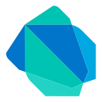
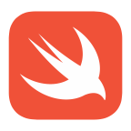
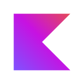
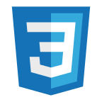
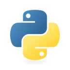
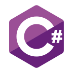

  
  

## My Career

- At **14**, I got into Unity and started learning my first programming language — **C#**.
- At **15**, I wanted to understand programming more deeply, so I began studying **C** and **Python** at the same time.
- At **16**, I mastered most of the basics of **C**, explored **Django** with Python, and also started learning **HTML/CSS**.
- At **17**, I built my first web app using Django — and that sparked my interest in **app development**. I'm currently creating mobile apps using **Dart** and **Flutter**.

## My Skills

### Mastery / 最強

  
  
  

### Currently Learning / 学習中

  
  
  
  
  

### On Hold / 今は使っていない

  
  
  
  
  

---

## My GitHub Stats

---

## Last Updated
<!-- AUTO_UPDATE_DATE -->
**2026-01-12 01:20:32 UTC**
<!-- END_AUTO_UPDATE_DATE -->

