

  
  

## Career

### 日本語

- **14歳** Unityに触れながら、初めてのプログラミング言語 **C#** を学び始める。
- **15歳** コーディングををより深く理解したく、**C** と **Python** を同時に学び始め競技プログラミングで遊ぶ。
- **16歳** **C** の基礎のほとんどを習得し、Python で **Django** を触れ、**HTML/CSS** 学び始ながら初めてのWebアプリケーションを作成。
- **17歳** **アプリ開発** に興味が湧き、Webアプリを開発すると同時に **Dart** と **Flutter** でモバイルアプリの分野を学んでいます。

### English

- At **14**, I started learning my first programming language — **C#** while exploring Unity.
- At **15**, I wanted to understand coding more deeply, so I began studying **C** and **Python** at the same time and started playing with competitive programming.
- At **16**, I mastered most of the basics of **C**, explored **Django** with Python, and created my first web application while starting to learn **HTML/CSS**.
- At **17**, I got interested in **app development** and am learning mobile app development with **Dart** and **Flutter** while also developing web apps.

---

## Skills

### Core / 主力
Main technologies I use to build and ship projects now.

  
  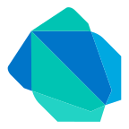
  
  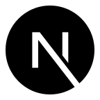
  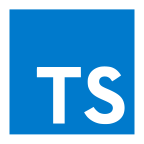
  

### Growing / 学習中
Technologies I actively study and apply in ongoing projects.

  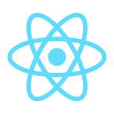
  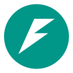
  
  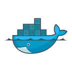
  
  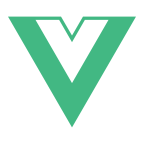
  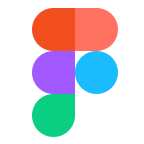
  
  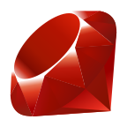
  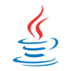
  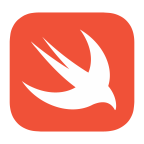
  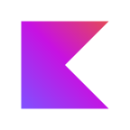

### Explored / 経験あり
Tools and languages I have used before.

  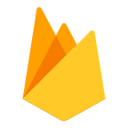
  
  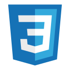
  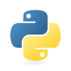
  
  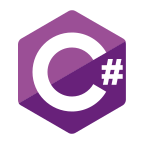

---

## Featured Project / 代表プロジェクト

### ThisOne #1

  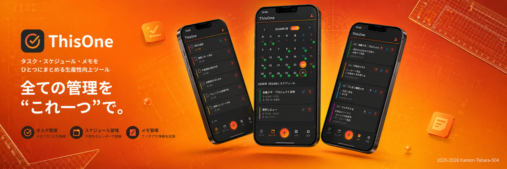

All-in-one task, schedule, and memo management.
A mobile application designed to improve everyday productivity.
タスク、スケジュール、メモ、を一つのアプリで一括管理！
日常生活の生産性向上を図るモバイルアプリケーションです。

- **Category:** Productivity
- **Platform:** iPhone
- **Repository:** [Kamon-Tahara-504/ThisOne](https://github.com/Kamon-Tahara-504/ThisOne)
- **Store:** [ThisOne #1 on the App Store](https://apps.apple.com/jp/app/thisone-1/id6755763891)

---

## GitHub Stats

---

## Last Updated
<!-- AUTO_UPDATE_DATE -->
**2026-04-27 02:12:28 UTC**
<!-- END_AUTO_UPDATE_DATE -->

